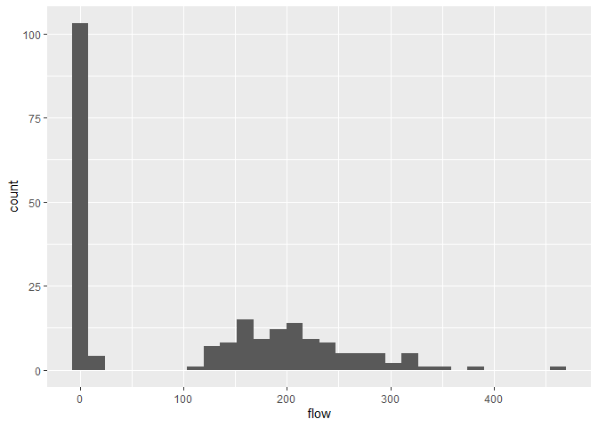
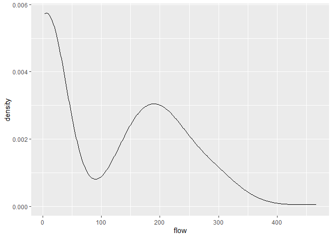
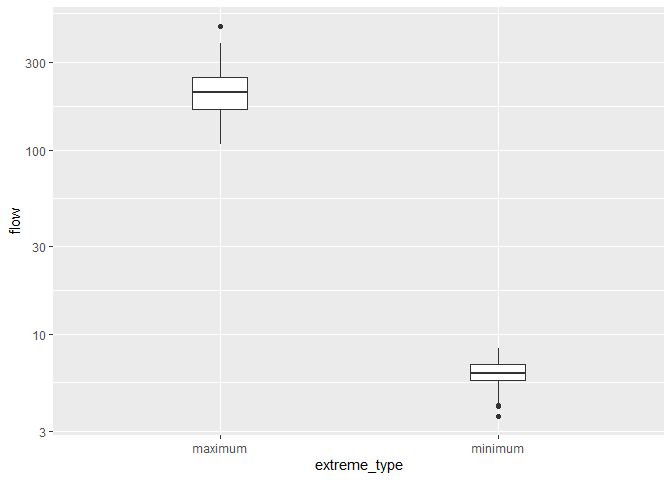
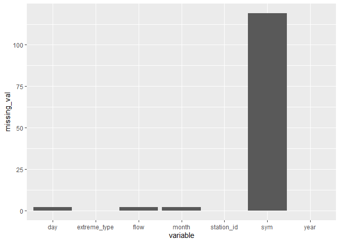
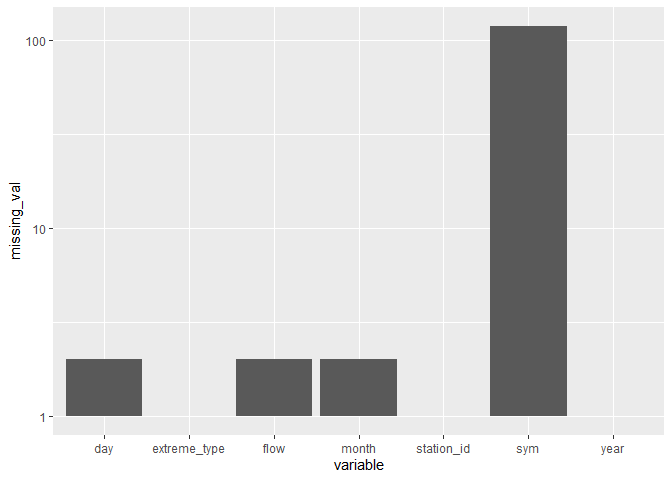
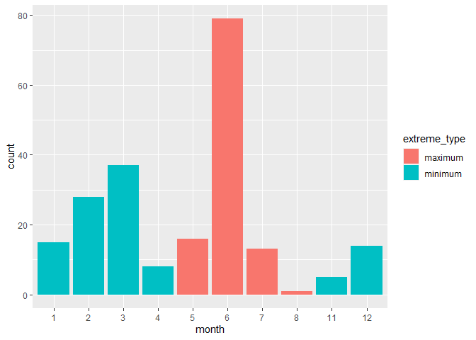
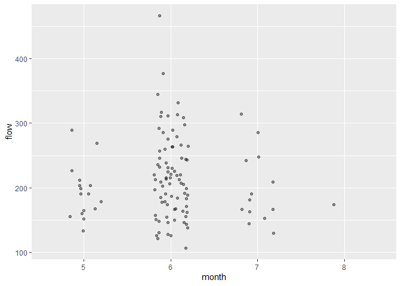
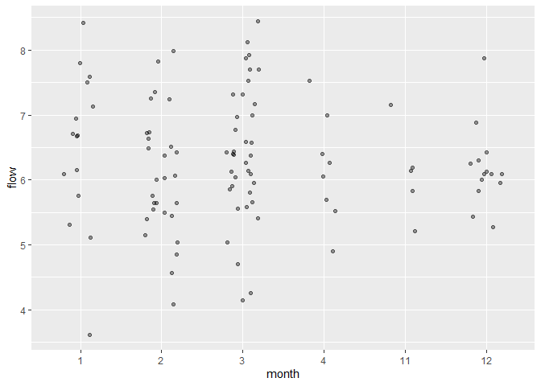
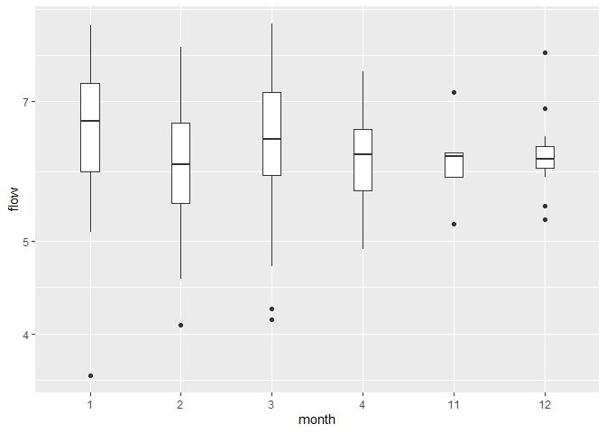
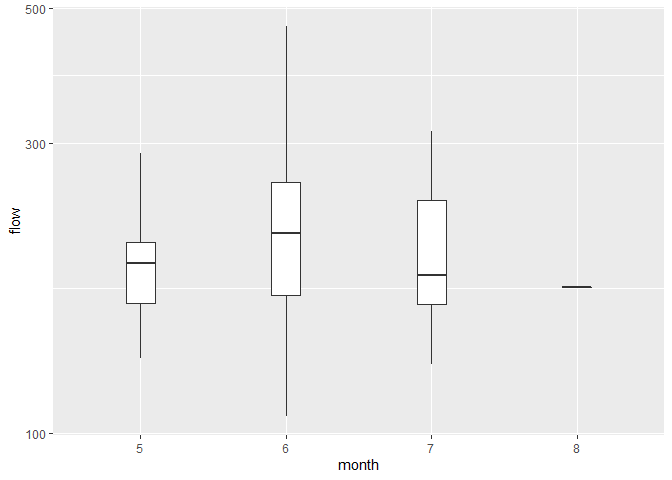

Mini Data-Analysis Deliverable 1
================

# Welcome to your (maybe) first-ever data analysis project!

And hopefully the first of many. Let’s get started:

1.  Install the [`datateachr`](https://github.com/UBC-MDS/datateachr)
    package by typing the following into your **R terminal**:

<!-- -->

    install.packages("devtools")
    devtools::install_github("UBC-MDS/datateachr")

2.  Load the packages below.

``` r
library(datateachr)
library(tidyverse)
```

    ## -- Attaching packages --------------------------------------- tidyverse 1.3.1 --

    ## v ggplot2 3.3.5     v purrr   0.3.4
    ## v tibble  3.1.4     v dplyr   1.0.7
    ## v tidyr   1.1.3     v stringr 1.4.0
    ## v readr   2.0.1     v forcats 0.5.1

    ## -- Conflicts ------------------------------------------ tidyverse_conflicts() --
    ## x dplyr::filter() masks stats::filter()
    ## x dplyr::lag()    masks stats::lag()

3.  Make a repository in the <https://github.com/stat545ubc-2021>
    Organization. You will be working with this repository for the
    entire data analysis project. You can either make it public, or make
    it private and add the TA’s and Vincenzo as collaborators.

4.  When you go to submit, submit a URL to your repository to canvas.

# Instructions

More details regarding the instructions and points allocated to each
task can be found below. Briefly,

-   Each milestone is worth 30 points. The number of points allocated to
    each task will be annotated within each deliverable. Tasks that are
    more challenging will often be allocated more points.

-   10 points will be allocated to the reproducibility, cleanliness, and
    coherence of the analysis. While the three milestones will be
    submitted as independent deliverables, the analysis itself is a
    continuum - think of it as 3 chapters to a story. Each chapter, or
    in this case, portion of your analysis, should be easily followed
    through by someone unfamiliar with the content.
    [Here](https://swcarpentry.github.io/r-novice-inflammation/06-best-practices-R/)
    is a good resource for what constitutes “good code”. Learning good
    coding practices early in your career will save you hassle later on!

# Learning Objectives

By the end of this milestone, you should:

-   Become familiar with your dataset of choosing
-   Think of 4 questions that you would like to answer with your data
-   Generate a reproducible and clear report using R Markdown

# Task 1: Choose your favorite dataset (10 points)

The `datateachr` package by Hayley Boyce and Jordan Bourak currently
composed of 7 semi-tidy datasets for educational purposes. Here is a
brief description of each dataset:

-   *apt_buildings*: Acquired courtesy of The City of Toronto’s Open
    Data Portal. It currently has 3455 rows and 37 columns.

-   *building_permits*: Acquired courtesy of The City of Vancouver’s
    Open Data Portal. It currently has 20680 rows and 14 columns.

-   *cancer_sample*: Acquired courtesy of UCI Machine Learning
    Repository. It currently has 569 rows and 32 columns.

-   *flow_sample*: Acquired courtesy of The Government of Canada’s
    Historical Hydrometric Database. It currently has 218 rows and 7
    columns.

-   *parking_meters*: Acquired courtesy of The City of Vancouver’s Open
    Data Portal. It currently has 10032 rows and 22 columns.

-   *steam_games*: Acquired courtesy of Kaggle. It currently has 40833
    rows and 21 columns.

-   *vancouver_trees*: Acquired courtesy of The City of Vancouver’s Open
    Data Portal. It currently has 146611 rows and 20 columns.

**Things to keep in mind**

-   We hope that this project will serve as practice for carrying our
    your own *independent* data analysis. Remember to comment your code,
    be explicit about what you are doing, and write notes in this
    markdown document when you feel that context is required. As you
    advance in the project, prompts and hints to do this will be
    diminished - it’ll be up to you!

-   Before choosing a dataset, you should always keep in mind **your
    goal**, or in other ways, *what you wish to achieve with this data*.
    This mini data-analysis project focuses on *data wrangling*,
    *tidying*, and *visualization*. In short, it’s a way for you to get
    your feet wet with exploring data on your own.

And that is exactly the first thing that you will do!

1.1 Out of the 7 datasets available in the `datateachr` package, choose
**4** that appeal to you based on their description. Write your choices
below:

**Note**: We encourage you to use the ones in the `datateachr` package,
but if you have a dataset that you’d really like to use, you can include
it here. But, please check with a member of the teaching team to see
whether the dataset is of appropriate complexity. Also, include a
**brief** description of the dataset here to help the teaching team
understand your data.

1: *building_permits*  
2: *cancer_sample*  
3: *flow_sample*  
4: *vancouver_trees*

1.2 One way to narrowing down your selection is to *explore* the
datasets. Use your knowledge of dplyr to find out at least *3*
attributes about each of these datasets (an attribute is something such
as number of rows, variables, class type…). The goal here is to have an
idea of *what the data looks like*.

*Hint:* This is one of those times when you should think about the
cleanliness of your analysis. I added a single code chunk for you, but
do you want to use more than one? Would you like to write more comments
outside of the code chunk?

``` r
#Exploring building_permits dataset
class(building_permits)
```

    ## [1] "spec_tbl_df" "tbl_df"      "tbl"         "data.frame"

``` r
dim(building_permits)
```

    ## [1] 20680    14

``` r
glimpse(building_permits)
```

    ## Rows: 20,680
    ## Columns: 14
    ## $ permit_number               <chr> "BP-2016-02248", "BU468090", "DB-2016-0445~
    ## $ issue_date                  <date> 2017-02-01, 2017-02-01, 2017-02-01, 2017-~
    ## $ project_value               <dbl> 0, 0, 35000, 15000, 181178, 0, 15000, 0, 6~
    ## $ type_of_work                <chr> "Salvage and Abatement", "New Building", "~
    ## $ address                     <chr> "4378 W 9TH AVENUE, Vancouver, BC V6R 2C7"~
    ## $ project_description         <chr> NA, NA, NA, NA, NA, NA, NA, NA, NA, NA, NA~
    ## $ building_contractor         <chr> NA, NA, NA, "Mercury Contracting Ltd", "08~
    ## $ building_contractor_address <chr> NA, NA, NA, "88 W PENDER ST  \r\nUnit 2069~
    ## $ applicant                   <chr> "Raffaele & Associates DBA: Raffaele and A~
    ## $ applicant_address           <chr> "2642 East Hastings\r\nVancouver, BC  V5K ~
    ## $ property_use                <chr> "Dwelling Uses", "Dwelling Uses", "Dwellin~
    ## $ specific_use_category       <chr> "One-Family Dwelling", "Multiple Dwelling"~
    ## $ year                        <dbl> 2017, 2017, 2017, 2017, 2017, 2017, 2017, ~
    ## $ bi_id                       <dbl> 524, 535, 539, 541, 543, 546, 547, 548, 54~

``` r
#Exploring flow_sample dataset
class(flow_sample)
```

    ## [1] "tbl_df"     "tbl"        "data.frame"

``` r
dim(flow_sample)
```

    ## [1] 218   7

``` r
glimpse(flow_sample)
```

    ## Rows: 218
    ## Columns: 7
    ## $ station_id   <chr> "05BB001", "05BB001", "05BB001", "05BB001", "05BB001", "0~
    ## $ year         <dbl> 1909, 1910, 1911, 1912, 1913, 1914, 1915, 1916, 1917, 191~
    ## $ extreme_type <chr> "maximum", "maximum", "maximum", "maximum", "maximum", "m~
    ## $ month        <dbl> 7, 6, 6, 8, 6, 6, 6, 6, 6, 6, 6, 7, 6, 6, 6, 7, 5, 7, 6, ~
    ## $ day          <dbl> 7, 12, 14, 25, 11, 18, 27, 20, 17, 15, 22, 3, 9, 5, 14, 5~
    ## $ flow         <dbl> 314, 230, 264, 174, 232, 214, 236, 309, 174, 345, 185, 24~
    ## $ sym          <chr> NA, NA, NA, NA, NA, NA, NA, NA, NA, NA, NA, NA, NA, NA, N~

``` r
#Exploring cancer_sample dataset
class(cancer_sample)
```

    ## [1] "spec_tbl_df" "tbl_df"      "tbl"         "data.frame"

``` r
dim(cancer_sample)
```

    ## [1] 569  32

``` r
glimpse(cancer_sample)
```

    ## Rows: 569
    ## Columns: 32
    ## $ ID                      <dbl> 842302, 842517, 84300903, 84348301, 84358402, ~
    ## $ diagnosis               <chr> "M", "M", "M", "M", "M", "M", "M", "M", "M", "~
    ## $ radius_mean             <dbl> 17.990, 20.570, 19.690, 11.420, 20.290, 12.450~
    ## $ texture_mean            <dbl> 10.38, 17.77, 21.25, 20.38, 14.34, 15.70, 19.9~
    ## $ perimeter_mean          <dbl> 122.80, 132.90, 130.00, 77.58, 135.10, 82.57, ~
    ## $ area_mean               <dbl> 1001.0, 1326.0, 1203.0, 386.1, 1297.0, 477.1, ~
    ## $ smoothness_mean         <dbl> 0.11840, 0.08474, 0.10960, 0.14250, 0.10030, 0~
    ## $ compactness_mean        <dbl> 0.27760, 0.07864, 0.15990, 0.28390, 0.13280, 0~
    ## $ concavity_mean          <dbl> 0.30010, 0.08690, 0.19740, 0.24140, 0.19800, 0~
    ## $ concave_points_mean     <dbl> 0.14710, 0.07017, 0.12790, 0.10520, 0.10430, 0~
    ## $ symmetry_mean           <dbl> 0.2419, 0.1812, 0.2069, 0.2597, 0.1809, 0.2087~
    ## $ fractal_dimension_mean  <dbl> 0.07871, 0.05667, 0.05999, 0.09744, 0.05883, 0~
    ## $ radius_se               <dbl> 1.0950, 0.5435, 0.7456, 0.4956, 0.7572, 0.3345~
    ## $ texture_se              <dbl> 0.9053, 0.7339, 0.7869, 1.1560, 0.7813, 0.8902~
    ## $ perimeter_se            <dbl> 8.589, 3.398, 4.585, 3.445, 5.438, 2.217, 3.18~
    ## $ area_se                 <dbl> 153.40, 74.08, 94.03, 27.23, 94.44, 27.19, 53.~
    ## $ smoothness_se           <dbl> 0.006399, 0.005225, 0.006150, 0.009110, 0.0114~
    ## $ compactness_se          <dbl> 0.049040, 0.013080, 0.040060, 0.074580, 0.0246~
    ## $ concavity_se            <dbl> 0.05373, 0.01860, 0.03832, 0.05661, 0.05688, 0~
    ## $ concave_points_se       <dbl> 0.015870, 0.013400, 0.020580, 0.018670, 0.0188~
    ## $ symmetry_se             <dbl> 0.03003, 0.01389, 0.02250, 0.05963, 0.01756, 0~
    ## $ fractal_dimension_se    <dbl> 0.006193, 0.003532, 0.004571, 0.009208, 0.0051~
    ## $ radius_worst            <dbl> 25.38, 24.99, 23.57, 14.91, 22.54, 15.47, 22.8~
    ## $ texture_worst           <dbl> 17.33, 23.41, 25.53, 26.50, 16.67, 23.75, 27.6~
    ## $ perimeter_worst         <dbl> 184.60, 158.80, 152.50, 98.87, 152.20, 103.40,~
    ## $ area_worst              <dbl> 2019.0, 1956.0, 1709.0, 567.7, 1575.0, 741.6, ~
    ## $ smoothness_worst        <dbl> 0.1622, 0.1238, 0.1444, 0.2098, 0.1374, 0.1791~
    ## $ compactness_worst       <dbl> 0.6656, 0.1866, 0.4245, 0.8663, 0.2050, 0.5249~
    ## $ concavity_worst         <dbl> 0.71190, 0.24160, 0.45040, 0.68690, 0.40000, 0~
    ## $ concave_points_worst    <dbl> 0.26540, 0.18600, 0.24300, 0.25750, 0.16250, 0~
    ## $ symmetry_worst          <dbl> 0.4601, 0.2750, 0.3613, 0.6638, 0.2364, 0.3985~
    ## $ fractal_dimension_worst <dbl> 0.11890, 0.08902, 0.08758, 0.17300, 0.07678, 0~

``` r
#Exploring vancouver_trees dataset
class(vancouver_trees)
```

    ## [1] "tbl_df"     "tbl"        "data.frame"

``` r
dim(vancouver_trees)
```

    ## [1] 146611     20

``` r
glimpse(vancouver_trees)
```

    ## Rows: 146,611
    ## Columns: 20
    ## $ tree_id            <dbl> 149556, 149563, 149579, 149590, 149604, 149616, 149~
    ## $ civic_number       <dbl> 494, 450, 4994, 858, 5032, 585, 4909, 4925, 4969, 7~
    ## $ std_street         <chr> "W 58TH AV", "W 58TH AV", "WINDSOR ST", "E 39TH AV"~
    ## $ genus_name         <chr> "ULMUS", "ZELKOVA", "STYRAX", "FRAXINUS", "ACER", "~
    ## $ species_name       <chr> "AMERICANA", "SERRATA", "JAPONICA", "AMERICANA", "C~
    ## $ cultivar_name      <chr> "BRANDON", NA, NA, "AUTUMN APPLAUSE", NA, "CHANTICL~
    ## $ common_name        <chr> "BRANDON ELM", "JAPANESE ZELKOVA", "JAPANESE SNOWBE~
    ## $ assigned           <chr> "N", "N", "N", "Y", "N", "N", "N", "N", "N", "N", "~
    ## $ root_barrier       <chr> "N", "N", "N", "N", "N", "N", "N", "N", "N", "N", "~
    ## $ plant_area         <chr> "N", "N", "4", "4", "4", "B", "6", "6", "3", "3", "~
    ## $ on_street_block    <dbl> 400, 400, 4900, 800, 5000, 500, 4900, 4900, 4900, 7~
    ## $ on_street          <chr> "W 58TH AV", "W 58TH AV", "WINDSOR ST", "E 39TH AV"~
    ## $ neighbourhood_name <chr> "MARPOLE", "MARPOLE", "KENSINGTON-CEDAR COTTAGE", "~
    ## $ street_side_name   <chr> "EVEN", "EVEN", "EVEN", "EVEN", "EVEN", "ODD", "ODD~
    ## $ height_range_id    <dbl> 2, 4, 3, 4, 2, 2, 3, 3, 2, 2, 2, 5, 3, 2, 2, 2, 2, ~
    ## $ diameter           <dbl> 10.00, 10.00, 4.00, 18.00, 9.00, 5.00, 15.00, 14.00~
    ## $ curb               <chr> "N", "N", "Y", "Y", "Y", "Y", "Y", "Y", "Y", "Y", "~
    ## $ date_planted       <date> 1999-01-13, 1996-05-31, 1993-11-22, 1996-04-29, 19~
    ## $ longitude          <dbl> -123.1161, -123.1147, -123.0846, -123.0870, -123.08~
    ## $ latitude           <dbl> 49.21776, 49.21776, 49.23938, 49.23469, 49.23894, 4~

1.3 Now that you’ve explored the 4 datasets that you were initially most
interested in, let’s narrow it down to 2. What lead you to choose these
2? Briefly explain your choices below, and feel free to include any code
in your explanation.

ANSWER: **I would be most interested to explore the flow_sample and
vancouver_trees datasets. After using a glimpse() function to look more
closely at the datasets, I could conclude that both of these dataset
contain data related to the environment - i.e. data related to the
different species of trees and the data on stream/river flows. These are
the topics I am most interested in personally and professionally, and
where I would be able to theoretically explain the correlations between
variables if I find any.**

1.4 Time for the final decision! Going back to the beginning, it’s
important to have an *end goal* in mind. For example, if I had chosen
the `titanic` dataset for my project, I might’ve wanted to explore the
relationship between survival and other variables. Try to think of 1
research question that you would want to answer with each dataset. Note
them down below, and make your final choice based on what seems more
interesting to you!

ANSWER: **Potential research question related to the vancouver_trees
dataset: How did the city’s preferences regarding what trees to plant
have changed over time?**

**Potential research questions related to the flow_sample dataset: What
are the patterns of annual variability of the streamflow?**

**I would prefer to explore flow_sample dataset**

# Important note

Read Tasks 2 and 3 *fully* before starting to complete either of them.
Probably also a good point to grab a coffee to get ready for the fun
part!

This project is semi-guided, but meant to be *independent*. For this
reason, you will complete tasks 2 and 3 below (under the **START HERE**
mark) as if you were writing your own exploratory data analysis report,
and this guidance never existed! Feel free to add a brief introduction
section to your project, format the document with markdown syntax as you
deem appropriate, and structure the analysis as you deem appropriate.
Remember, marks will be awarded for completion of the 4 tasks, but 10
points of the whole project are allocated to a reproducible and clean
analysis. If you feel lost, you can find a sample data analysis
[here](https://www.kaggle.com/headsortails/tidy-titarnic) to have a
better idea. However, bear in mind that it is **just an example** and
you will not be required to have that level of complexity in your
project.

# Task 2: Exploring your dataset (15 points)

If we rewind and go back to the learning objectives, you’ll see that by
the end of this deliverable, you should have formulated *4* research
questions about your data that you may want to answer during your
project. However, it may be handy to do some more exploration on your
dataset of choice before creating these questions - by looking at the
data, you may get more ideas. **Before you start this task, read all
instructions carefully until you reach START HERE**.

2.1 Complete *4 out of the following 8 exercises* to dive deeper into
your data. All datasets are different and therefore, not all of these
tasks may make sense for your data - which is why you should only answer
*4*. Use *dplyr* and *ggplot*.

-   [x] Plot the distribution of a numeric variable.
-   [ ] Create a new variable based on other variables in your data
    (only if it makes sense)
-   [x] Investigate how many missing values there are per variable. Can
    you find a way to plot this?
-   [x] Explore the relationship between 2 variables in a plot.
-   [x] Filter observations in your data according to your own criteria.
    Think of what you’d like to explore - again, if this was the
    `titanic` dataset, I may want to narrow my search down to passengers
    born in a particular year…
-   [x] Use a boxplot to look at the frequency of different observations
    within a single variable. You can do this for more than one variable
    if you wish!
-   [x] Make a new tibble with a subset of your data, with variables and
    observations that you are interested in exploring.
-   [x] Use a density plot to explore any of your variables (that are
    suitable for this type of plot).

2.2 For each of the 4 exercises that you complete, provide a *brief
explanation* of why you chose that exercise in relation to your data (in
other words, why does it make sense to do that?), and sufficient
comments for a reader to understand your reasoning and code.

# Task 3: Write your research questions (5 points)

So far, you have chosen a dataset and gotten familiar with it through
exploring the data. Now it’s time to figure out 4 research questions
that you would like to answer with your data! Write the 4 questions and
any additional comments at the end of this deliverable. These questions
are not necessarily set in stone - TAs will review them and give you
feedback; therefore, you may choose to pursue them as they are for the
rest of the project, or make modifications!

<!--- *****START HERE***** --->

## Exploring Data and Distribution

First, the distribution of data should be explored to gain more
understanding on what data the variables store. This would allow to
determine, for example, whether the flow variable only stores maximum
and minimum extreme events or other flow data.

To explore the data, the dataset shall firstly be converted to a tibble:

``` r
flow_sample <- as_tibble(flow_sample)
class(flow_sample)
```

    ## [1] "tbl_df"     "tbl"        "data.frame"

Next, **the distribution** of the flow will be explored. The following
code produces histogram, which shows the frequency of different values
of flow. The histogram has 30 bins and the missing values are omitted.

``` r
flow_distribution1 = ggplot(flow_sample, aes(flow)) +geom_histogram(bins=30,na.rm=TRUE)
print(flow_distribution1)
```

<!-- -->

As can be seen from the histogram, the most common values taken by the
variable “flow” are near-zero values.

Another way to visualize the distribution of flow values is by
**plotting its density**:

``` r
flow_distribution2 <- ggplot(flow_sample, aes(x = flow))+ geom_density(na.rm=TRUE)
print(flow_distribution2)
```

<!-- -->

As can be seen from the density plot, the majority of values of flow are
low - i.e. below 75, however there is an increase in the density around
200, which suggests that there is a considerable amount of values of
flow around 200.

Based on the observed distribution of the flow data, as well as the fact
that data is split in two categories (“maximum” and “minimum”) by the
categorical variable “extreme_type”, the conclusion may be reached that
the dataset only displays the extreme flow events.

This assumption can be verified by creating a boxplot. The boxplot with
a logarithmic scale is plotted to ensure a meaningful visual
representation considering a significant spread of values of flow.

``` r
flow_boxplot <- ggplot(flow_sample, aes(extreme_type, flow))+ geom_boxplot(width = 0.2)+scale_y_log10()
print(flow_boxplot)
```

    ## Warning: Removed 2 rows containing non-finite values (stat_boxplot).

<!-- -->

The boxplot verified the assumption that the maximum and minimum
categories correspond to maximum and minimum extreme flow events.

## Exploring Missing Values

Next, it is also important to explore the missing values in the dataset
to understand the limitations of the data and hence develop research
questions that can realistically be answered with this dataset.

To explore the missing values, the data frame will be created containing
the number of missing values for each of the variables

``` r
#creating a data frame containing names of the variables in the first column and the corresponding number of missing values in the second column
flow_missing <-data.frame(names(flow_sample), colSums(is.na(flow_sample)))

#Adding meaninful column names:
names(flow_missing)[1] <- "variable"
names(flow_missing)[2] <- "missing_val"
```

Bar chart can be plotted to represent the number missing values per
variable:

``` r
flow_missing_bar = ggplot(flow_missing, aes(variable,missing_val)) + geom_bar(stat="identity")
print(flow_missing_bar)
```

<!-- -->

As can be seen from the plot, the majority of the missing values are in
column “sym”. Because of the significant differences in the number of
missing data between “sym” and other variables, it is hard to visually
assess how much data is missing in other columns. Hence, it may be
valuable to look at the plot at logarithmic scale:

``` r
flow_missing_bar +scale_y_log10()
```

    ## Warning: Transformation introduced infinite values in continuous y-axis

    ## Warning: Removed 3 rows containing missing values (geom_bar).

<!-- -->

From this plot it can be derived that few data is missing from columns
“day”, “flow”, and “month”, while large amont of data is missing for
variable “sym”

## Exploring the relation between variables

Next, it would be valuable to explore the relation between month and
extreme flow event. Particularly I would like to find during which
months the maximum flow usually occurs, and during which months the
minimum flow occurs.

### Creating new tibble holding a subset of flow_sample data

To achieve this, first, **a tibble should be created that only holds the
variables “flow”, “month”, and “extreme_type” and does not have any
missing data**. Missing data will be removed after creating a subset to
preserve as much data as possible. For example, if missing data were
removed before creating a subset, it may result in a loss of entire rows
of data where only “day” or “sym” variables are missing. This would
limit the analysis of the relation between month and flow.

``` r
#Creating a subset of the data with columns "month", "flow", and "extreme_type"
flow_subset <- flow_sample %>%
    select(month, flow, extreme_type) %>%
    na.omit() #removing rows with missing values

print(flow_subset)
```

    ## # A tibble: 216 x 3
    ##    month  flow extreme_type
    ##    <dbl> <dbl> <chr>       
    ##  1     7   314 maximum     
    ##  2     6   230 maximum     
    ##  3     6   264 maximum     
    ##  4     8   174 maximum     
    ##  5     6   232 maximum     
    ##  6     6   214 maximum     
    ##  7     6   236 maximum     
    ##  8     6   309 maximum     
    ##  9     6   174 maximum     
    ## 10     6   345 maximum     
    ## # ... with 206 more rows

Next, it should be verified whether the “month” column is categorical,
and if not its class should be changed accordingly

``` r
class(flow_subset$month) 
```

    ## [1] "numeric"

``` r
flow_subset$month=as.factor(flow_subset$month) #this formula makes makes the column categorical

#Checking the class again:
class(flow_subset$month)
```

    ## [1] "factor"

### Exploring the relation between variables “month” and “flow” using bar chart

To explore how the extreme flow events are distributed across the
months, a bar chart will be created. While a bar char cannot provide an
insight on the magnitude of the individual flow events that have
occurred during each of the months, it provides a valuable information
on the number of extreme flow events that have occurred during each of
the months.

The following code plots the bar graph showing the number of the extreme
flow events that have occurred each month. The colors differentiate
between maximum and minimum flow events:

``` r
flow_subset_bar <-ggplot(flow_subset, aes(month)) + geom_bar(aes(fill=extreme_type))
print(flow_subset_bar)
```

<!-- -->

As can be seen from the bar graph, the majority of the maximum flow
events occur in June, while most of the minimum flow events were
observed in March. Moreover, there have not been any overlap in the
months in which minimum and maximum events occur. In other words, there
have not been a month, in which both a maximum and minimum flow was
observed.

### Exploring the characteristics of the extreme flow events

It may also be valuable to look in more details at the values of flow
observed in each of the months. Hence, as a next step of the data
analysis, I would like to present the relation between the month and the
extreme flow in two graphs: One showing only maximum flow and another
showing only minimum flow. This would allow to gain a better insight
into the annual variations in the magnitude of each category of the
extreme flow events.

To achieve this, two more subsets will be created - one for extreme_type
“minimum” and one for extreme_type “maximum” - **using the filter()
function**

``` r
#Creting subset with only minimum extreme flow events
flow_subset_min <- filter(flow_subset, extreme_type=="minimum")

#Creating subset with only maximum extreme weather events:
flow_subset_max <- filter(flow_subset, extreme_type=="maximum")
```

#### Jitter plot

**Maximum flow:**

The following graph visualizes the extreme maximum flow events recorded
in each of the months:

``` r
flow_max_jitter <-ggplot(flow_subset_max, aes(month, flow)) + 
  geom_jitter(alpha = 0.4, width=0.2)
print(flow_max_jitter)
```

<!-- -->

As can be seen from the graph, the majority and the highest magnitude of
the maximum flow events occur in June. May and July have experienced
fewer number of maximum flow events. Finally, August have only
experienced one maximum flow event.

**Minimum flow:**

The following graph displays the extreme minimum flow events recorded in
each of the months:

``` r
flow_min_jitter <-ggplot(flow_subset_min, aes(month, flow)) + geom_jitter(alpha = 0.4, width=0.2)
print(flow_min_jitter)
```

<!-- -->

As can be seen from the graph, minimum flow events occur in January,
February, March, April, November and December. The lowest flow was
observed in January, followed by February and March.

#### Boxplot

Another way to visualize the values of flow observed in each of the
months is by plotting boxplot.

``` r
flow_min_boxplot <-ggplot(flow_subset_min, aes(month, flow))+ geom_boxplot(width = 0.2)+scale_y_log10()
print(flow_min_boxplot)
```

<!-- -->

As can be seen from the boxplot, the lowest mean flow was observed in
February, while the lowest value even recorded occurred in January.

A similar boxplot can be created for maximum flow:

``` r
flow_max_boxplot <-ggplot(flow_subset_max, aes(month, flow))+ geom_boxplot(width = 0.2)+scale_y_log10()
print(flow_max_boxplot)
```

<!-- -->

As can be seen from the boxplot, the highest mean of the maximum flow
occurred in June. Moreover, June was the month when the highest flow was
recorded,

### Research Questions

1.  Have the maximum flow events increased in magnitude or frequency
    since 1909?

2.  When did the absolute maximum and minimum magnitude of the flow
    occur?

3.  Does the annual distribution of the extreme flow events changed over
    time? For example, were most of the minimum/maximum that have
    occurred in past 10 years observed in a similar time than those in
    1909-1919 or have the pattern shifted?

4.  Have the number of data entries that are estimated or have
    significant gaps during the day (sym=E or sym=B, respectively)
    decreased over time?

### Attribution

Thanks to Icíar Fernández Boyano for mostly putting this together, and
Vincenzo Coia for launching.
