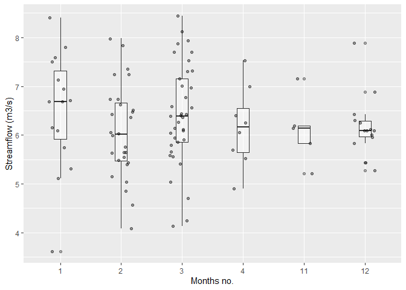
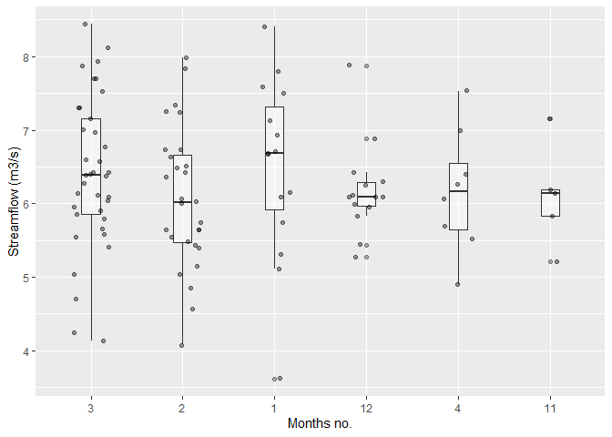
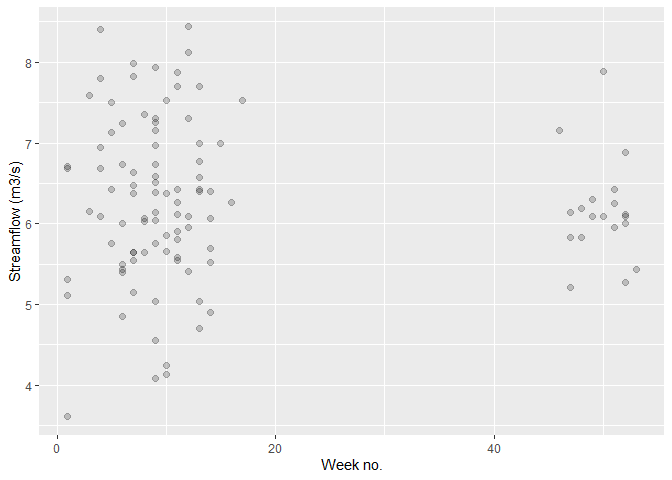

Mini Data-Analysis Deliverable 3
================

#Mini Data-Analysis Deliverable 3

Loading the packages:

``` r
suppressMessages(library(datateachr))
suppressMessages(library(tidyverse))
suppressMessages(library(lubridate))
```

Research question chosen in milestone 2:

1.  **Have the maximum flow events exhibited a statistically significant
    increase in magnitude since 1909?**

2.  **Is there a significant difference in the annual distribution of
    the extreme flow events between 1909-1929 and 2000-2018?**

# Exercise 1: Special Data Types

First I will create a new figure that will be modified later in this
exercise. The figure will show the flow values for **minimum** extreme
type per each of the months using jitter plot and boxplot. This figure
may be useful in answering a potential research question “When do the
minimum extreme weather events usually occur?” and “What is the median
minimum flow in each of the months”

To plot this figure I will (1) create a subset of the data, which will
consist only of the columns month, flow, and extreme_type, (2) filter
data so that only minimum extreme type events are left, (3) omit any
missing values, (4) convert month variable into a categorical variable.
Following this, the graph will be plotted.

``` r
#Creating a subset of the flow_sample dataset:

flow_subset <- flow_sample %>%
  
  #selecting only columns month, flow, and extreme_type:
  select(month, flow, extreme_type) %>%
  
  #making sure only minimum flow events are included
  filter(extreme_type=="minimum")%>%
  
  #omitting rows with any missing values:
  na.omit()


#Making column "month" categorical
flow_subset$month=as.factor(flow_subset$month)


#creating a plot with two geom layers - boxplot and jitter
flow_min <- flow_subset %>%
  ggplot(aes(month, flow)) + 
  geom_boxplot(alpha = 0.4, width=0.2)+ #geom layer 1
  geom_jitter(alpha = 0.4, width=0.2)+  #geom layer 2
  labs(y="Streamflow (m3/s)", x="Months no.") #changing axis labels

print(flow_min)
```

<!-- -->

The displayed plot presents flow values for **minimum** extreme type per
each of the months using jitter plot and boxplot.

### Task 1: Reordering a factor (month)

The following code will re-order months based on the number of
observations corresponding to each month in a **descending order** (from
largest to lowest number)

``` r
#Reordering "month" factor in a descending order and plotting the graph:

flow_min_reordered <- flow_subset %>%
  mutate(month = fct_infreq(month)) %>% #reorders factor "month"
  ggplot(aes(month, flow)) + 
  geom_boxplot(alpha = 0.4, width=0.2)+ #geom layer 1 
  geom_jitter(alpha = 0.4, width=0.2)+ #geom layer 2
  labs(y="Streamflow (m3/s)", x="Months no.") #chaning labels

print(flow_min_reordered)
```

<!-- -->

**I chose to re-order months in the descending order, so that my plot
shows the months that have the highest number of minimum flow
observations first. This allows me to quickly determine which months had
the most observations of minimum flow events. Without reordering it was
not very clear, and it had to be guessed based on the density of points
(which may be challenging if there are two months with similar, but not
the same, number of observations).**

**While this task does not directly address the questions posed in this
milestone, it could help answering a research question “When do the
minimum extreme flow events usually occur?” and to quickly determine
what was the median flow on the month when the most minimum extreme flow
event occurred historically. This information may facilitate planning
for such events, which may be extremely important if there are
communities that rely on this stream for their drinking water.**

### Task 3: Exploring week number when minimum flow events occur

To achieve this task, I will first create a new column that will hold
information of the date when each of the minimum flow events occurred.

``` r
flow_min_date <- flow_sample %>%
  
  #Removing the columns that will not be needed:
  select(-station_id, -sym) %>%
  
  #only including minimum flow:
  filter(extreme_type=="minimum") %>%

  #omitting rows with any missing values:
  na.omit() %>%
  
  #arranging observations by year, since we are interested in the changes over time (from oldest to recent):
  arrange(year) %>%
  
  #adding columns for "date" which will store information on when the minimum flow event have occurred
  mutate(date = mdy(paste(month, day, year, sep=" "))) %>%
  
  #removing columns "month", "day", "year" as they are no longer needed after the "date" column was created:
  select(-month, -day, -year)


#checking the result:
head(flow_min_date)
```

    ## # A tibble: 6 x 3
    ##   extreme_type  flow date      
    ##   <chr>        <dbl> <date>    
    ## 1 minimum       5.75 1911-02-27
    ## 2 minimum       5.8  1912-03-14
    ## 3 minimum       6.12 1913-03-18
    ## 4 minimum       7.16 1914-11-17
    ## 5 minimum       6.94 1915-01-27
    ## 6 minimum       6.97 1916-03-02

Next, I can derive the number of the week when each of these minimum
flow events have occurred:

``` r
flow_min_week <- flow_min_date %>%
  mutate(week_number = week(date)) #adding a column with the week number

head(flow_min_week)
```

    ## # A tibble: 6 x 4
    ##   extreme_type  flow date       week_number
    ##   <chr>        <dbl> <date>           <dbl>
    ## 1 minimum       5.75 1911-02-27           9
    ## 2 minimum       5.8  1912-03-14          11
    ## 3 minimum       6.12 1913-03-18          11
    ## 4 minimum       7.16 1914-11-17          46
    ## 5 minimum       6.94 1915-01-27           4
    ## 6 minimum       6.97 1916-03-02           9

Plotting the result

``` r
flow_min_week_plot <- flow_min_week %>%
  ggplot(aes(week_number, flow)) +
  geom_point(alpha = 0.2, size=2)+ #adjusting transparency because of overlap
  labs(y="Streamflow (m3/s)", x="Week no.") #changing the labels

print(flow_min_week_plot)
```

<!-- -->

The plot shows which week the minimum flow events have occurred (all
years of the dataset are accounted). Week is defined as *the number of
complete seven day periods that have occurred between the date and
January 1st, plus one.*

**This is useful for data analysis as it allows to derive on which weeks
of the year the minimum flow events usually occur. This provides more
precision as compared to looking at which months these event usually
occur (which was the case in the previous graph). Similarly to the
previous task, this graph may help to answer a research question “When
do the minimum extreme weather events usually occur?”**

# Exercise 2: Modelling

## 2.0 (no points)

Choosing a research question, and a variable of interest (“Y”) that’s
relevant to the research question.

**Research Question**: **Have the maximum flow events exhibited a
statistically significant increase in magnitude since 1909?**

**Variable of interest**: The variable of interest is “flow”

## 2.1 (5 points)

In the following, I will fit a linear model that examines the relation
between variables “flow” and “year” to test the significance of
regression (i.e. if there is a correlation between the year and the
flow). Only maximum flow will be selected to answer this research
question. Fitting a linear model should enable to determine whether the
maximum flow events exhibited a significant increase (or declined) in
magnitude since the beginning of the dataset.

First, I will create a subset which will only consist of the columns
*‘year’* and *‘flow’*, and will only have the observations of maximum
flow.

``` r
flow_subset2.1 <- flow_sample %>%
  
  #Only selecting maximum flow
  filter(extreme_type=="maximum") %>%
  
  #Only selecting columns year and flow
  select(year, flow) %>%
  
  #Omitting rows with any missing values
  na.omit()
```

After the subset is created, the linear model will be fitted, exploring
the relationship between flow and year:

``` r
flow_model <- lm(flow ~ year, flow_subset2.1)

print(flow_model)
```

    ## 
    ## Call:
    ## lm(formula = flow ~ year, data = flow_subset2.1)
    ## 
    ## Coefficients:
    ## (Intercept)         year  
    ##     946.202       -0.374

## 2.2 (5 points)

Now, I will produce a **p-value** of the fitted model. The following
code will output the specific cell of the tibble representing p-value

``` r
answer2.2 <-broom::glance(flow_model)[5]
print(answer2.2)
```

    ## # A tibble: 1 x 1
    ##   p.value
    ##     <dbl>
    ## 1  0.0458

p-value shows the significance of the results. Considering p-value is
lower than 0.05, there is a significant correlation between year and
maximum flow.

# Exercise 3: Reading and writing data

Creating a folder called *‘output’* in the top level of the project
folder/repository:

``` r
dir.create(here::here("output"))
```

    ## Warning in dir.create(here::here("output")): 'C:\Users\margo\STAT545
    ## course\mpustova_data_analysis_attempt2\output' already exists

## 3.1 (5 points)

In the following, I will retrieve a summary table from Milestone 2
(Exercise 1.2), and write it as a csv file in the `output` folder.

Retrieving the table from Milestone 2. The presented code was prevously
explained in the Milestone 2 (see mini-data_analysis-2.md):

``` r
#creating new column "decade" based on the year:
flow_sample_decades <- flow_sample %>%
  mutate(decade = case_when(year<1920 ~ "1909-1919",
                          year<1930 ~ "1920-1929",
                          year<1940 ~ "1930-1939",
                          year<1950 ~ "1940-1949",
                          year<1960 ~ "1950-1959",
                          year<1970 ~ "1960-1969",
                          year<1980 ~ "1970-1979",
                          year<1990 ~ "1980-1989",
                          year<2000 ~ "1990-1999",
                          year<2010 ~ "2000-2009",
                          year<2019 ~ "2010-2018"))

#Filtering out missing data from the column "extreme_type" and "flow" and storing the result in a new dataframe called "flow_q1" (which stands for flow_question1)
flow_q1 <- flow_sample_decades %>%
  filter(!is.na(extreme_type), !is.na(flow))

#Calculating summary statistics:
flow_q1_summary <- flow_q1 %>%
  group_by(decade,extreme_type) %>%
  summarize(flow_mean = mean(flow), flow_range = range(flow))
```

    ## `summarise()` has grouped output by 'decade', 'extreme_type'. You can override using the `.groups` argument.

Writing the output into a .csv file in the ‘output’ folder

``` r
write_csv(flow_q1_summary, here::here("output", "flow_q1_summary.csv"))
```

## 3.2 (5 points)

Writing the model object as a R binary file in the *‘output’* folder:

``` r
saveRDS(flow_model, here::here("output", "flow_model.rds"))
```

Reading the model output from RDS file:

``` r
readRDS(here::here("output", "flow_model.rds"))
```

    ## 
    ## Call:
    ## lm(formula = flow ~ year, data = flow_subset2.1)
    ## 
    ## Coefficients:
    ## (Intercept)         year  
    ##     946.202       -0.374
